# OSINTech Projects Change Log

A chronological archive of selected projects, research activities, experiments, tools, and technical work previously listed in the OSINTech GitHub profile README.

---

## 2026

### Sep 2026 — Martin

[Martin](https://github.com/bormaxi8080/martin-codex-pet) is a custom animated pet for Codex Desktop. He is an original, stylized interpretation inspired by the stage persona of British musician Martyn Jacques, founder and frontman of The Tiger Lillies.

### Aug 2026 — fcc-model-check

[fcc-model-check]() is a Bash health-check utility for validating model routing between Free Claude Code (FCC) and NVIDIA NIM.

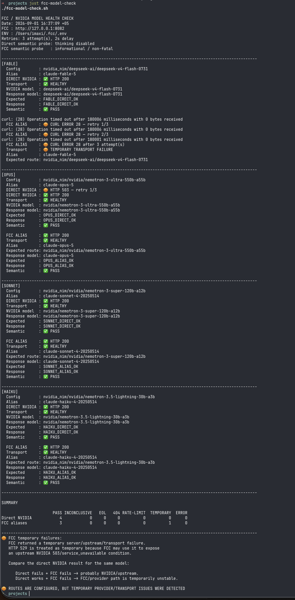

### Jun 2026 — Evidentia / Sourcely

Evidentia / Sourcely — software for journalists, fact-checkers, and OSINT researchers to verify sources, structure evidence, and turn open data into trustworthy investigations.

### Jun 2026 — just-ai

[just-ai](https://github.com/bormaxi8080/just-ai). This repository is a fork of just with additional just-ai functionality. The core just behavior stays the same: recipes from a justfile still run through the regular just binary, recipe syntax is unchanged, and existing projects do not need AI configuration. just-ai is shipped as an extension next to just, not as a replacement for it. It uses just --dump --dump-format json to read a structured description of the justfile, builds compact project context, scores command risk locally, and sends that context to a configured OpenAI-compatible provider only for AI commands.

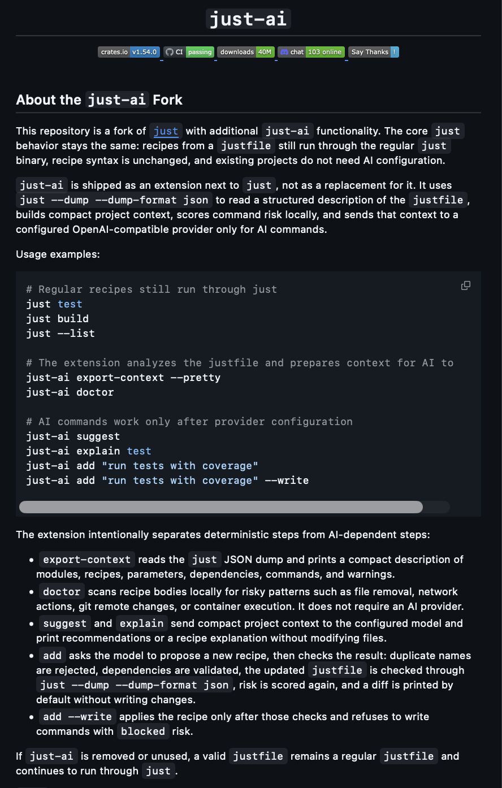

### Jun 2026 — Source Credibility Overlay

[Source Credibility Overlay](https://github.com/bormaxi8080/sco-chrome-extension) Chrome Extension Prototype. Chrome extension plus backend API for transparent source credibility signals. The project does not claim that a site is fake or malicious. It collects technical and contextual signals, explains them, and recommends manual verification when risk is elevated.

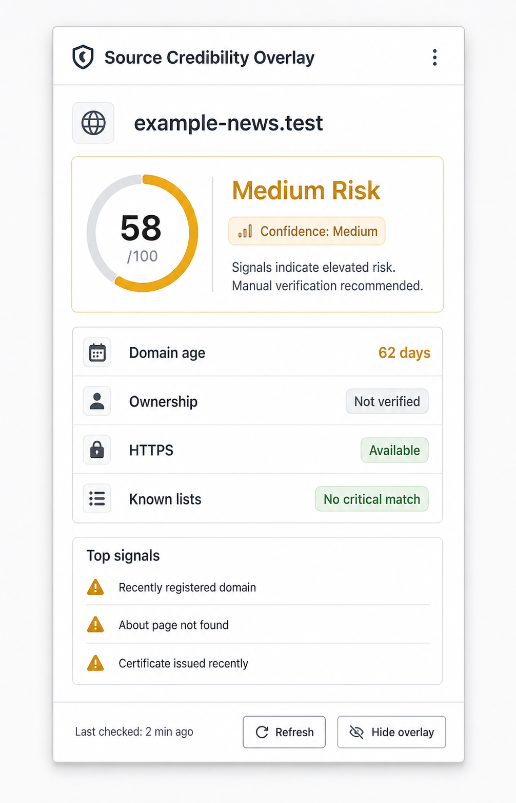

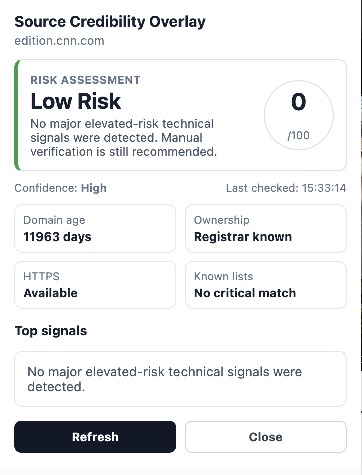

### Jun 2026 — Pravda New Prototype

A backend utility/service for capturing web pages as evidence: it opens a URL in real Chrome via Playwright, saves a snapshot of the page and metadata, so that it can later be provably shown: "This is what the page looked like at time X." Essentially, it's not a fact-checker per se, but an "evidence layer" for fact-checking/OSINT/archiving.

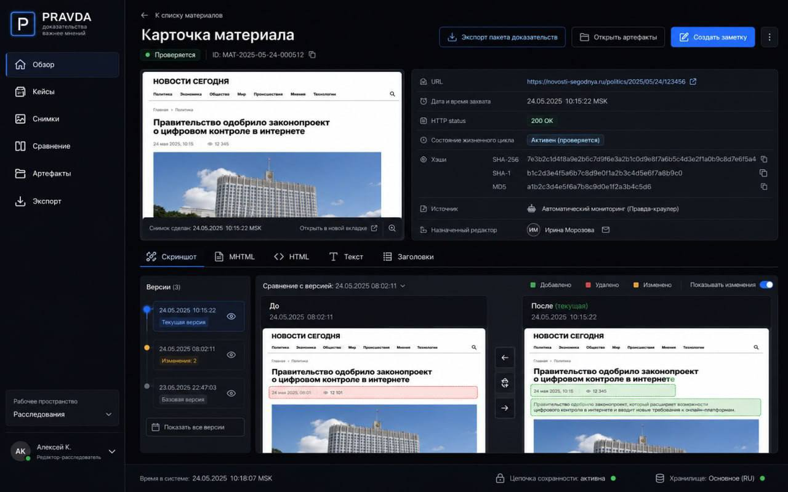

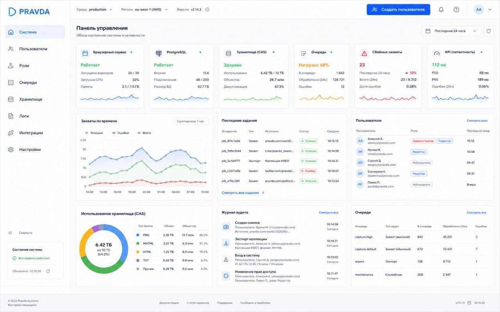

### Jun 2026 — US Department of War UFO Archive Snapshot

[US Department of War UFO Archive Snapshot](https://www.war.gov/UFO/) with full JSON Structured Dataset. Parsed by Oriol Web Crawler System.

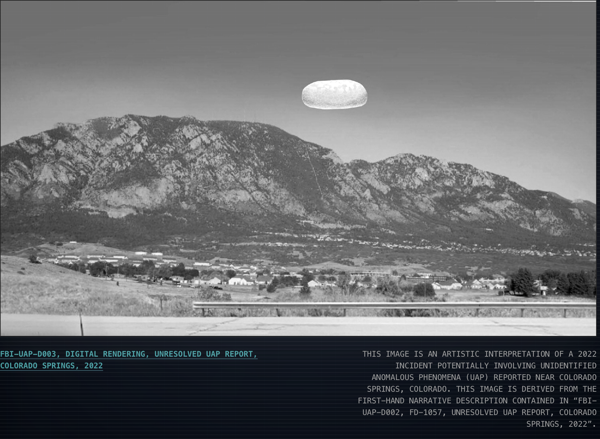

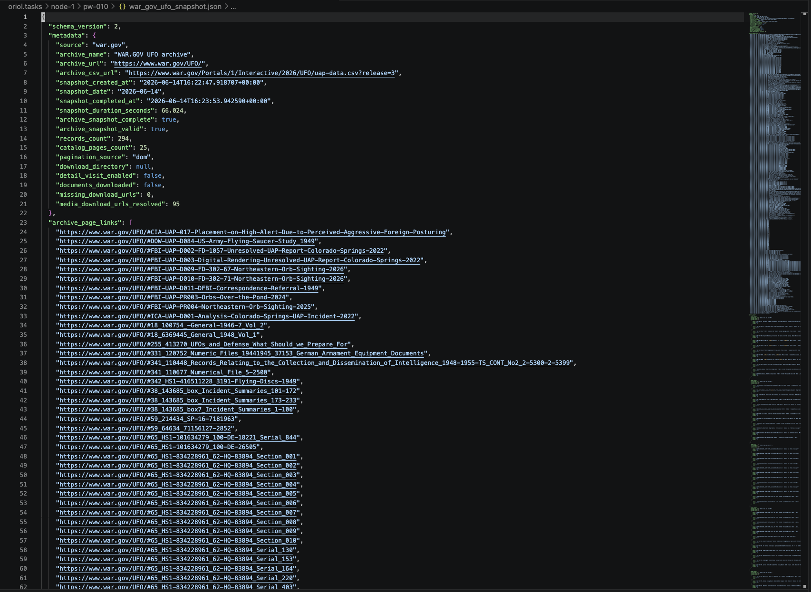

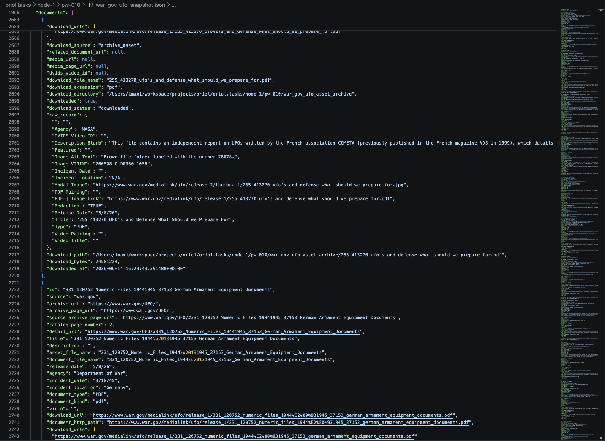

### Jun 2026 — The OA Human Resource Intelligence System Concept

The OA Human Resource Intelligence System Concept

### Jun 2026 — OpenRouter / Claude / NVIDIA Nemotron / CodeBase / Free Claude Code Experiments

OpenRouter/Claude/NVIDIA Nemotron/CodeBase/Free Claude Code Experiments

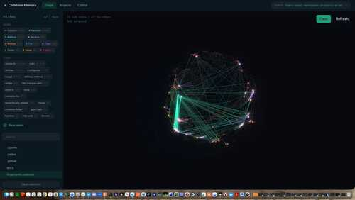

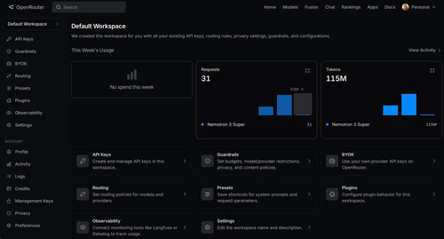

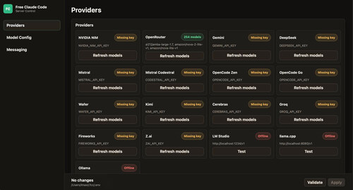

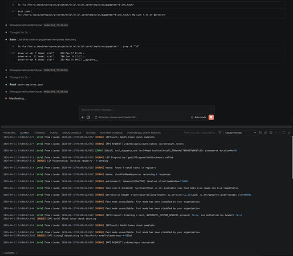

### May 2026 — Oriol Web Crawler

A scalable system for complex browser automation, data collection, web script testing, and distributed traffic management.

- Multithreaded Python server with a management console.
- Support for multiple automation engines: Puppeteer, Camoufox, Playwright, Requests, AdsPower, and others.
- Dynamically enabled scenarios, including those generated and adapted by AI.
- Probabilistic action model: transitions, views, clicks, scrolling, interactions with buttons, links, sliders, and other interface elements.
- and other features...

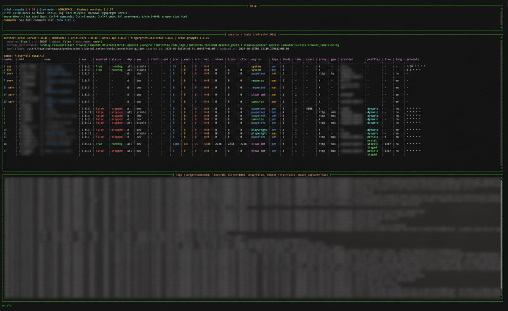

#### Oriol Fingerprint Collector

Standalone local diagnostic web server for browser and device fingerprint collection tests. This subproject is isolated from runtime.

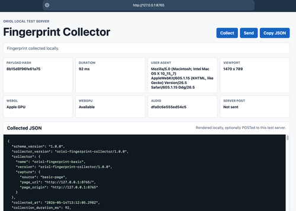

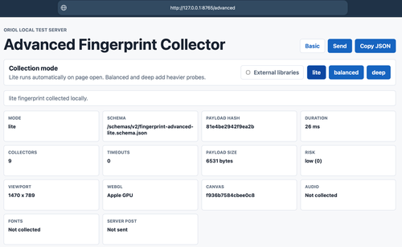

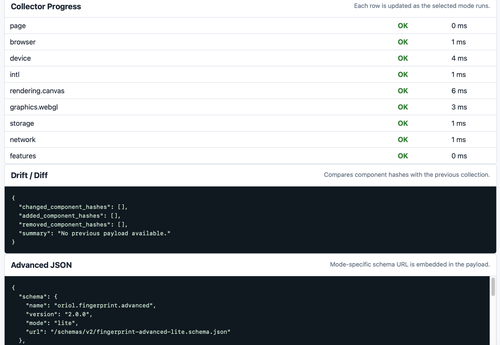

### Mar 2026 / Now — CyberYozh Academy

[CyberYozh Academy](https://academy.cyberyozh.com)

Act as Subject Matter Expert

### Aug 2025 / May 2026 — Tesari.AI

[Tesari.AI](https://tesari.ai)

Act as Subject Matter Expert & Library Curator:

- Leveraged advanced methodologies to support investigative processes and align with organizational objectives.
- Ensured the effective curation of data for actionable insights, enhancing overall operational efficiency.

Act as OSINT Engineer:

- Contributed as an OSINT Engineer at Tesari AI, focusing on data collection and management.

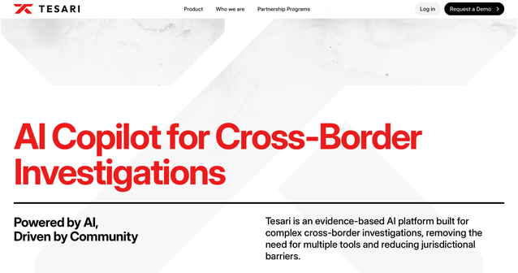

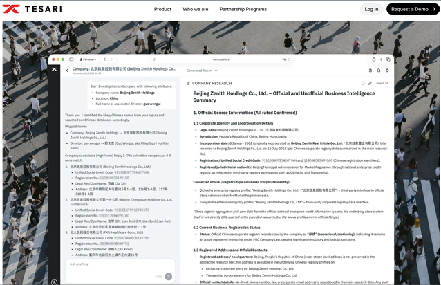

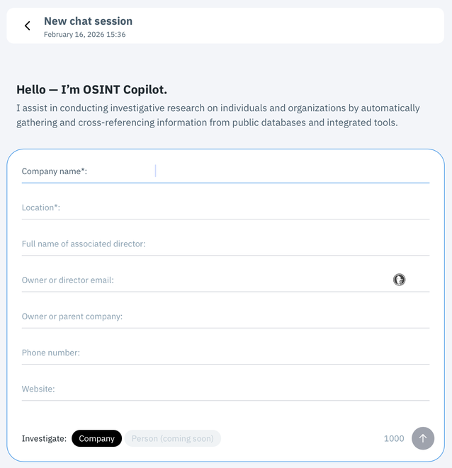

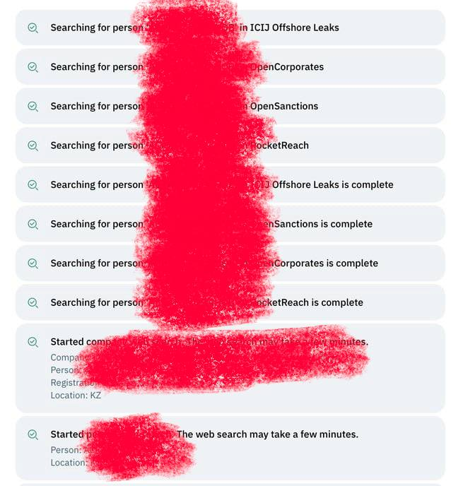

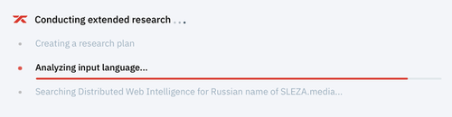

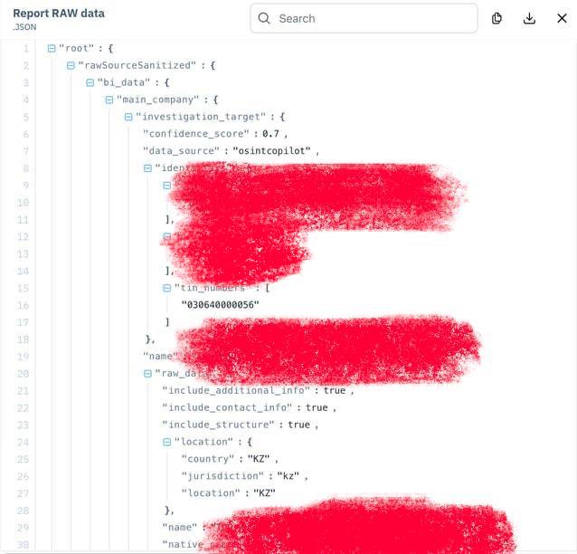

### Feb 2026 — CRPA Metadata Extractor

A service for checking images and videos for CR/CRPA tags, which identify an image or video as AI-generated content.

CR stands for Content Credentials. It is a digital label of content origin that: serves as a visible and invisible mark of an image's origin, indicates the source, generation tool (e.g., ChatGPT with DALL·E 3), and the date of production, indicates that the image was generated, in whole or in part, by AI.

Visible elements often include a small "cr" icon in the corner of the image. When clicked or hovered over, these elements can reveal details via metadata—the equivalent of a digital signature attached to the file.

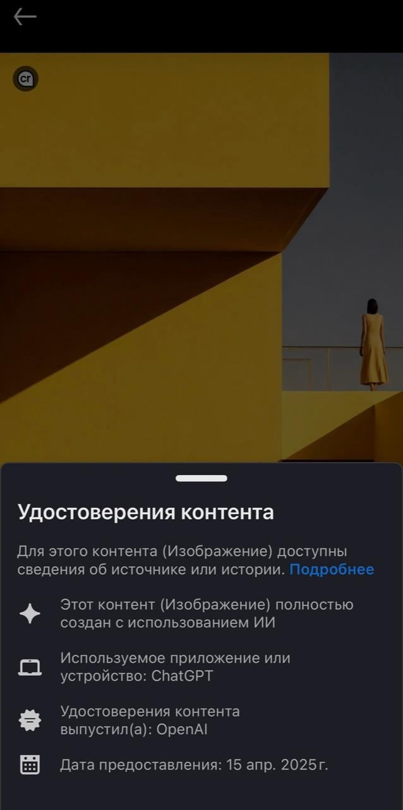

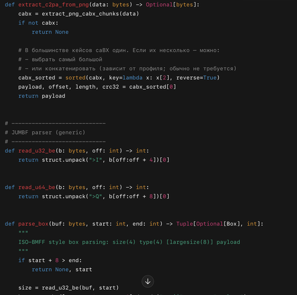

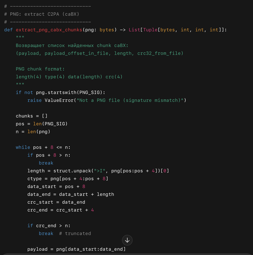

### Feb 2026 — OSINTech Scam Surface Mapper

[OSINTech Scam Surface Mapper](https://github.com/bormaxi8080/Scam-Surface-Mapper)

Scam Surface Mapper is a browser service based on GitHub Pages designed for OSINT investigators, fact-checkers, and cybersecurity researchers. It analyzes web pages to identify and visualize potential scam infrastructure by mapping outgoing links, analyzing suspicious domains, tracking parameters, and presenting findings in an interactive graph interface. The tool was created with the assistance of Perplexity AI & OpenAI Codex.

Modified version of [Pogoda Scam Surface Mapper](https://github.com/paulpogoda/Scam-Surface-Mapper)

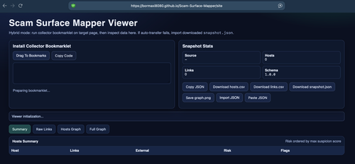

### May 2026 — Locus

Fork of Pavel Bannikov's repository **Locus** is an app for geolocating photos and video frames. It uses Google Maps by default and analyzes visual details to determine where and when an image was taken. Upload an image and let AI identify its location using landmarks, architecture, and environmental clues.

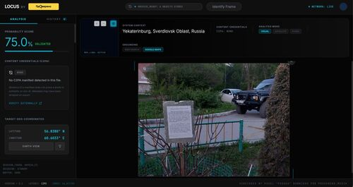

### Jan 2026 — Epshtein Archive Parser

[Epshtein Archive Parser](https://github.com/bormaxi8080/ea-parser) A small toolkit to download and analyze files from the DOJ Epstein Archives and to inspect PDF collections for duplicates and redactions, and decomposite masked blocks. 6787 unmasked blocks on 89Gb data. Private repository, available on demand.

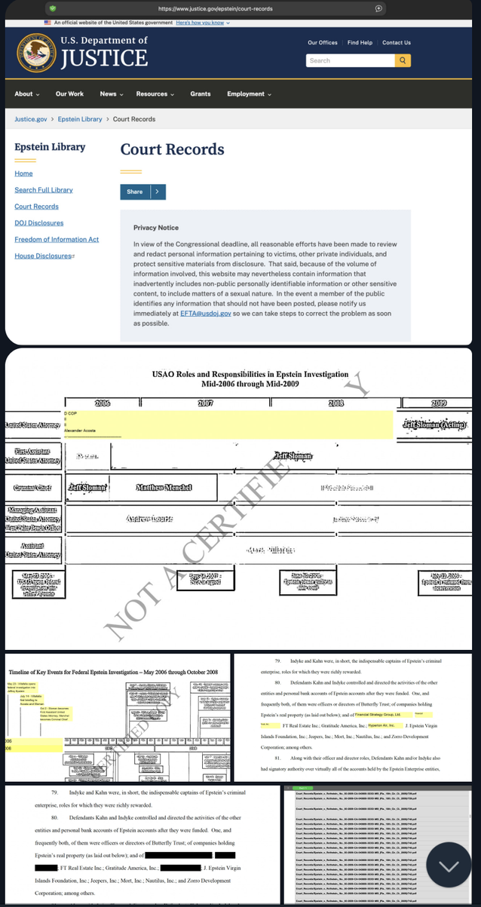

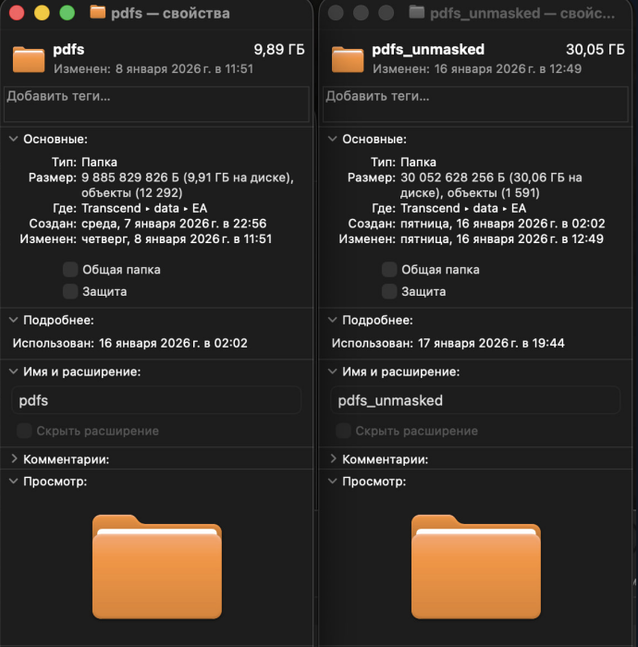

### Jan 2026 — IonaFlow

[IonaFlow](https://newsmonitor.app) News Monitor Integrations

IonaFlow is a news intelligence platform combining comprehensive source coverage with AI-powered analysis. The platform consolidates thousands of sources into organised, searchable feeds with flexible filtering.

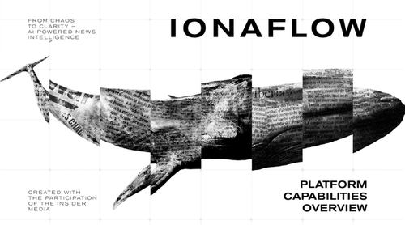

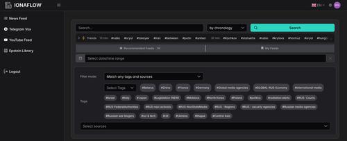

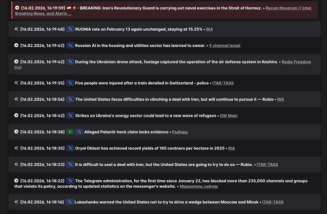

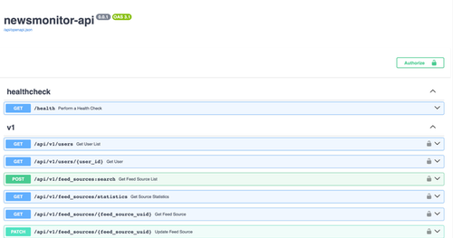

### Jan 2026 — OSINT Repos Intelligence Pack

OSINT Repos Intelligence Pack on [Substack](https://osintech.substack.com/) and [GitHub](https://github.com/bormaxi8080/osint-repos-list) of GitiHub Repositories and its creators (more than 3000 repositories and contributors). Private repository, available on demand.

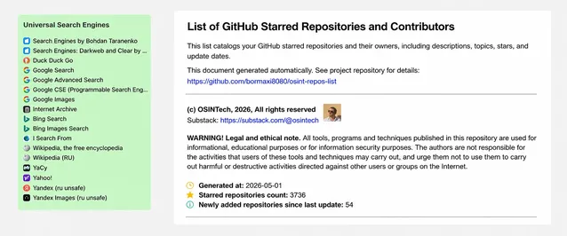

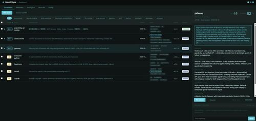

---
## 2025

### Dec 2025 — ABCs of Prompt Engineering

Together with [@paulpogoda](https://github.com/paulpogoda), we authored the course "ABCs of Prompt Engineering" on the specifics of AI and prompt engineering. The course consisted of four lectures and was held on the [kislorod.io](https://kislorod.io) platform.

Links: [1](https://youtu.be/ZjCBUa1SO14), [2](https://youtu.be/7bR25QI8zug), [3](https://youtu.be/PmQr18f-im0), [4](https://www.youtube.com/watch?v=TJfwld8qsRw)

### Apr 2023 / Now — OSINT Timelines and Collections

OSINT Timelines and Collections activities on [Substack](https://osintech.substack.com/) and [GitHub](https://github.com/bormaxi8080/osint-timeline)

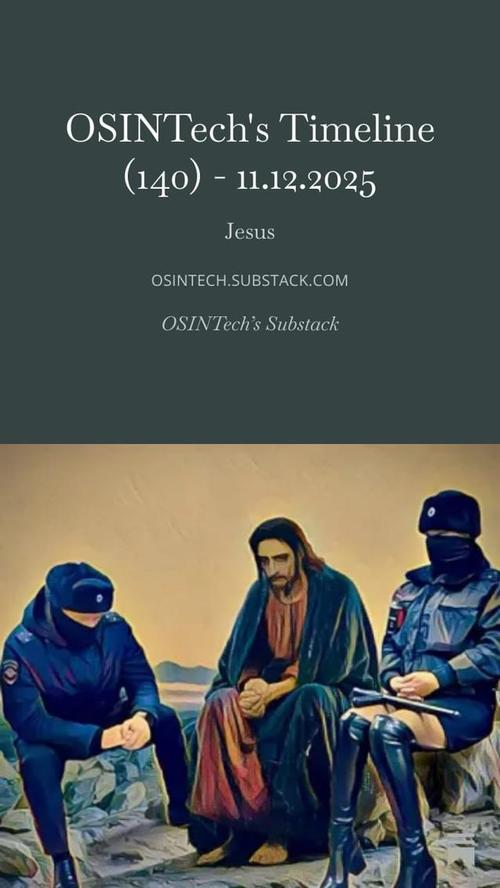

---

## 2024

### Aug 2024 / Sep 2025 — Profiling OSINT Courses

Completed [@paulpogoda](https://github.com/paulpogoda) Profiling OSINT Courses

---

## 2022–2024

### Jun 2022 / Now — OSINT & Investigative Journalistic Activities

Private projects about collecting social data.

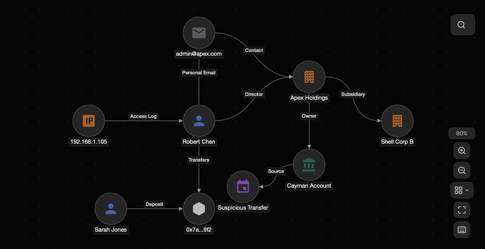

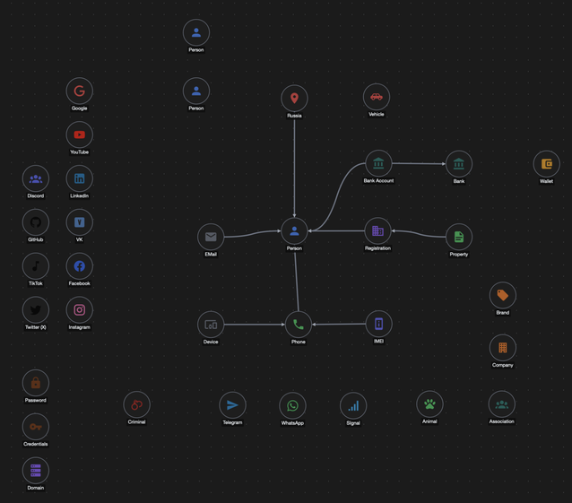

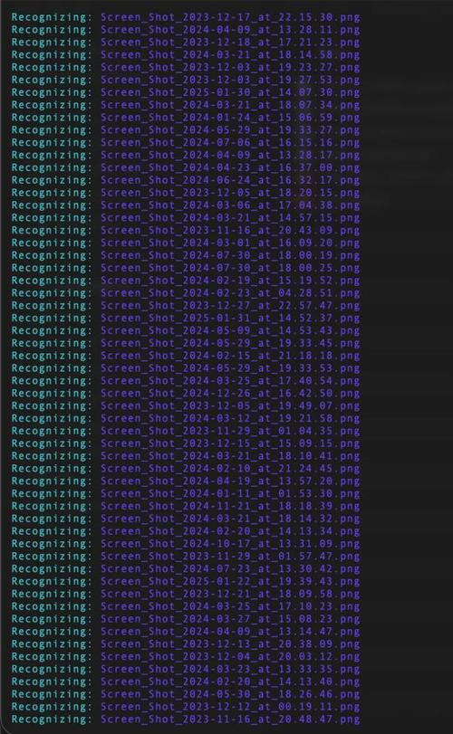

### Nov 2022 / Sep 2025 — Private AD Processing Projects

Private projects about AD processing (big conveyor)

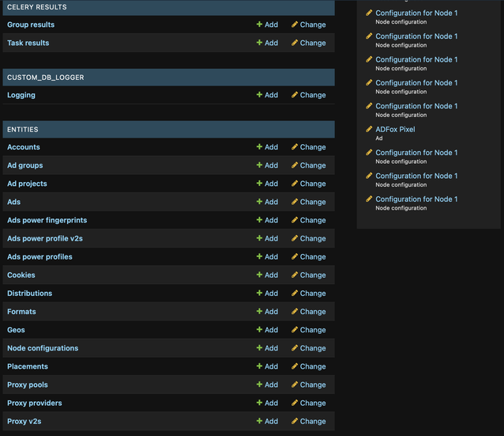

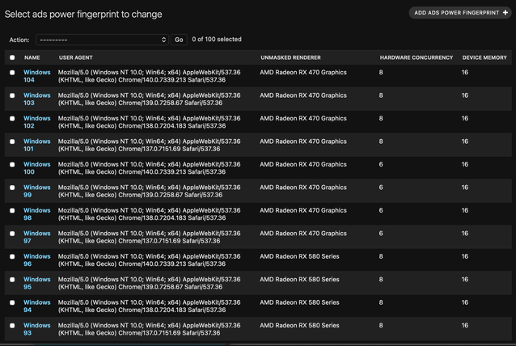

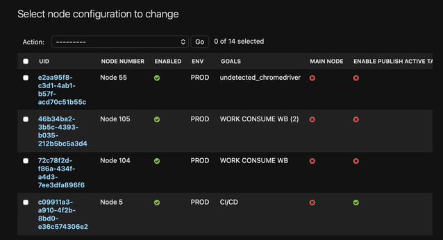

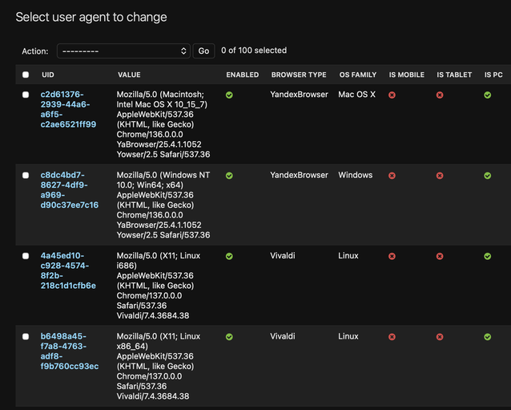

### Nov 2022 / Aug 2024 — Private OSINT Email Checking Projects

Private OSINT projects for email Checking (Big Conveyors), Database loading, verification, etc.

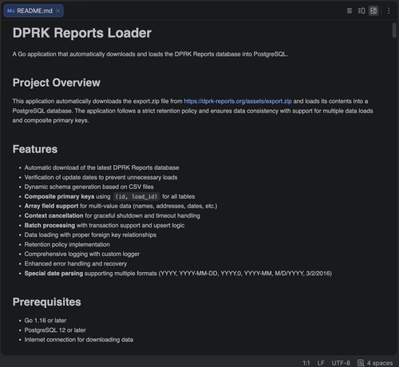

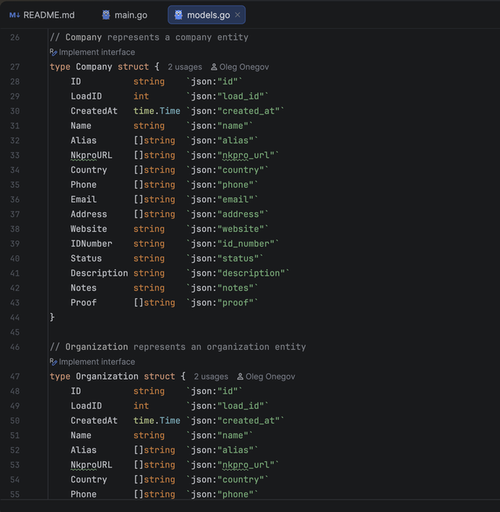

### Jan 2023 / Apr 2023 — LinkedIn Company Data Collection

Private project about collecting companies data on LinkedIn.

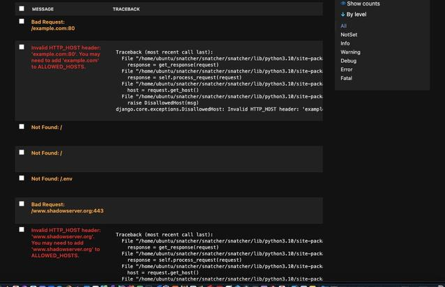

### Mar 2022 / Aug 2024 — War Crimes Documentation Project

War Crimes Documentation project help (non-disclosured).

### Sep 2022 — linkedin2md

Create [linkedin2md repository](https://github.com/bormaxi8080/linkedin2md) illustrates a scheme for building a simple resume/profile database based on a minimalist approach and storing structured profile information in markdown format. Transferring my data (about 50,000 people profiles) from proprietary formats to markdown.

### 2022 — Huginn

[Huginn](https://github.com/bormaxi8080/huginn) private fork/community commits

### 2022 — OSINT Framework

[OSINT Framework fork](https://github.com/bormaxi8080/OSINT-Framework)

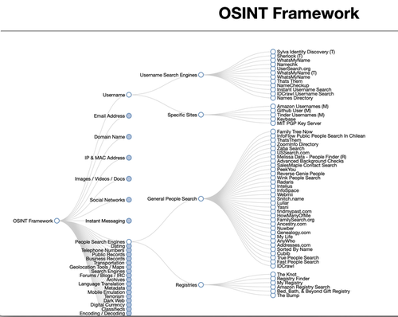

### 2022 — Telepathy

[Telepathy](https://github.com/bormaxi8080/Telepathy) project updates & [components](https://telepathy.freedesktop.org/components/)

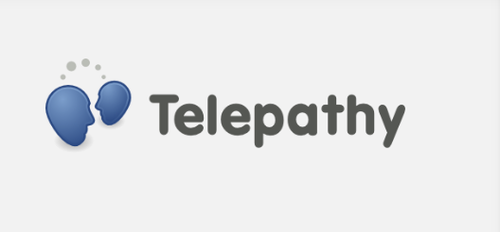

### 2022 — facebook-ban-phrases

Start a [facebook-ban-phrases](https://github.com/bormaxi8080/facebook-ban-phrases) project, the list of phrases in different languages for which you can get banned on Facebook.

### Feb 2022 — batu-poll-checker

Create [batu-poll-checker](https://github.com/bormaxi8080/batu-poll-checker) utility for monitoring the results of voting for orangutan Batu in the election of a New Year's mascot in Novosibirsk, Russia, february 2022, with all the world and Russian media wrote about this incident.

### Jan 2022 — NMap Packet Domain List Scanner

Create a [NMap packet domain list scanner](https://github.com/bormaxi8080/nmap-scanner) utility, some OSINT tools experiments.

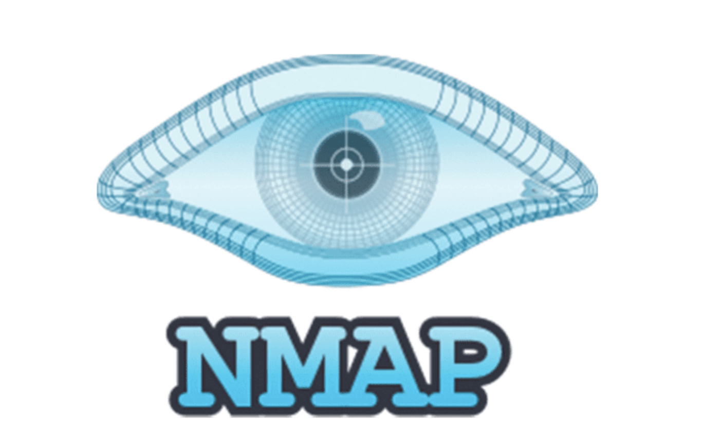

### Jun 2021 / Dec 2024 — RIP Leaks

A **RIP Leaks** community project, publicly oppose the processes of Russian import substitution, including in the IT sector, and cover news on this topic. Project closed.

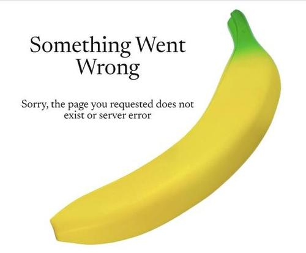

---

## Earlier Projects

### Jun 2020 — Ebenya Rodiny

Start a Ebenya Rodiny project, one of the largest collections of graffiti and street art in the world.

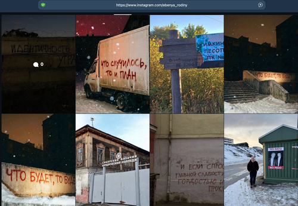

### 2015 — Hiring Agency

A small warm tube recruitment agency. Recruitment geography: Novosibirsk, remote location, relocation from the RF to Europe (I took more than 260 families outside the Russian Federation).

Hiring candidates in IT from the middle level.

Automated candidate database of 30+ thousand people.

I created my own community, for 6 years I gained a lot of connections and insights among different companies at different times in the team from 1 to 6 recruiters.

Worked with companies such as Exness, Intel, Plesk, DevExperts, Think-Cell and many others.

A lot of different communications and activities.

### 2013 — Pencil Test

A [Pencil Test](https://habr.com/ru/articles/193902/) habr's publication with 1M+ views.

### 2000 / 2015 — Software Development in Various Projects

Software Development in various projects.

---
