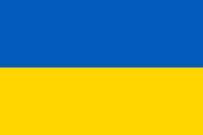

Hi all, I am @bormaxi8080 (https://twitter.com/HiddenDjoker) aka Maxim Marshak, sociopathic cat lover, technical hiring specialist, OSINT enthusiast and software developer with journalism and DevOps activities.

I Develop in Python, Node.js, GoLang, Perl, Bash.
Sometimes I hire people targeted for positions in the IT level from middle+, with relocation outside the Russian Federation. 
Write about hiring in IT, HR Tech, development, I participate in various professional communities.

### Main projects:

- [Bormaxi About Hiring](https://github.com/bormaxi8080/bormaxi-about-hiring): Hiring Notes in IT and international recruitment (on examples with cats, obscene language and naked truth), not finished

- [Teamlead](https://github.com/bormaxi8080/teamlead): Fork Sharovatov's everything about leadership

- [OSINT Framework v.2](https://github.com/bormaxi8080/OSINT-Framework): Revised and modified version of https://osintframework.com OSINT mindmap service

- [Huginn](https://github.com/huginn/huginn) (private), a system for building agents that perform automated tasks for you online

### My social links:

GitHub: https://github.com/bormaxi8080

Twitter: https://twitter.com/HiddenDjoker

LinkedIn: https://www.linkedin.com/in/maxim-marshak/

Facebook: https://www.facebook.com/bormaxi

### My technology stack:

- Python, Node.js, JavaScript, TypeScript, GoLang, Perl

- PostgreSQL, MongoDB, MySql, Redis, Celery, RabbitMQ

- AWS (EC2, S3, RDS, Route 53, DynamoDB), ClickHouse, Prometheus, Grafana

- Async.IO, AIOgram, Google API, Nest.js, Express, REST API, Swagger, Selenium, mutli threading, multi processssing, sharding, etc.

- Perl, Bash, and at different times a bunch of all sorts of exotics, mainly integration, for parsing, scraping and data enrichment

- Linux (Ubuntu, Debian, Kali Linux, Amazon Linux, Mikrotik OS), AWS, MacOS, Windows, Docker - at the level of normal DevOps

- Java, C++, .NET - at the level of “I can, but without fanaticism”

- PHP - at the level of “collect or fix something quickly”

- Vue, React - at the level of understanding how it works (there is no industrial experience in frontend development)

- UX, Figma, CSS, Styles - I can make it nice if needed

### My profile notices:

Unlike many people who are interested in OSINT and information security, I do not seek to be anonymous, and information about me is open to a reasonable extent. This is a principled position aimed at popularizing research activities and supporting democratic values ​​in the world.

For quite a long time I was engaged in hiring specialists in IT and took about 150 families outside the Russian Federation. With the beginning of the war in Ukraine, I left Russia.

In parallel with the development and hiring in IT, I was involved in the development of various communities, including non-core for IT, and met a lot of interesting and famous people: social activists, journalists, politically concerned citizens, HR, PR people, developers, security specialists, etc. At a certain point, this activity logically led me to become interested in OSINT.

This is a rather non-standard path in a career, but the circumstances have developed.

### My communities:

**- RIP Leaks** - Chronicles of sinking Russian import substitution: https://t.me/RIPLeaks

We publicly oppose the processes of Russian import substitution, including in the IT sector, and cover news on this topic

**- Marshak**: https://t.me/mmarshak

Our family channel based on [Marshak's poetry](https://ru.wikipedia.org/wiki/%D0%9C%D0%B0%D1%80%D1%88%D0%B0%D0%BA,_%D0%A1%D0%B0%D0%BC%D1%83%D0%B8%D0%BB_%D0%AF%D0%BA%D0%BE%D0%B2%D0%BB%D0%B5%D0%B2%D0%B8%D1%87)

**- No Morals** (by invite for confirmed users): https://www.facebook.com/groups/netmorali/

Private humorous community, founded in 2015

**- Yebenya Rodiny** (aka Fucking Motherland): https://www.instagram.com/ebenya_rodiny/

One of the largest collections of street art in the world

**- NeLen.In**: https://www.instagram.com/nelen.in/

Sarkasm anti-communist photo collection about Vladimir Lenin and the Soviet era

### My resume links:

[My Resume in Markdown](./resume/bormaxi_resume_tech_EN.md)

[My resume on LinkedIn (PDF)](https://www.linkedin.com/in/maxim-marshak/details/featured/1635500516525/single-media-viewer/)

### My projects timeline:

Continued...

Aug 2022 - [Huginn](https://github.com/bormaxi8080/huginn) works (private)

Aug 2022 - [OSINT Framework fork](https://github.com/bormaxi8080/OSINT-Framework), version 2.0

Aug 2022 - Create a new [account on Twitter](https://twitter.com/HiddenDjoker)

Jul 2022 - [Telepathy](https://github.com/bormaxi8080/Telepathy) project updates (Bellingcat fork)

Jun 2022 - Start some OSINT collections and tools

Jun 2022 - Create a new [account on LinkedIn](https://www.linkedin.com/in/maxim-marshak/)

Jun 2022 - Start a [facebook-ban-phrases](https://github.com/bormaxi8080/facebook-ban-phrases) project, the list of phrases in different languages for which you can get banned on Facebook

May-Jun 2022 - Leave Russia (evacuation)

Mar-May 2022 - Prepare and change my server infrastrucure and communities to the military situation in the world

Mar 2020 - Start [Marshak's Telegram Channel](https://t.me/mmarshak)

Feb 2020 - Create [batu-poll-checker](https://github.com/bormaxi8080/batu-poll-checker) utility for monitoring the results of voting for orangutan Batu in the election of a New Year's mascot in Novosibirsk, Russia, february 2022, with Forbes and other scandal publications. Details is [here](https://www.facebook.com/sergey.a.boyko/posts/2039961386176848)

Jan 2022 - Create a [NMap packet domain list scanner](https://github.com/bormaxi8080/nmap-scanner) utility, some OSINT tools experiments

Dec 2021 - Pull my [ITHRMemes](https://github.com/bormaxi8080/ITHRMemes) humor collection on GitHub (since 2015)

Dec 2021 - Start a some projects and collections, create forks on GitHub. Experiments with tools and bash scripts, aka [emergency-shutdown](https://github.com/bormaxi8080/emergency-shutdown) bash script for MacOS

Dec 2021 - Start a [bormaxi-about-hiring](https://github.com/bormaxi8080/bormaxi-about-hiring) book project

Dec 2021 - Close my hiring agency and checkout into NDA place as software developer

June 2021 - Start a [RIP Leaks](https://t.me/RIPLeaks) community project,  publicly oppose the processes of Russian import substitution, including in the IT sector, and cover news on this topic

Jun 2020 - Start a [Yebenya Rodiny](https://www.instagram.com/ebenya_rodiny/) (aka Fucking Motherland) project

Mar 2020 - Compelled Coming Out by private reasons

Jun 2019 - Start hiring developers in Improve Group, the best all-time IT company in Novosibirsk, mobile application development. Hiring employees, hiring employees, hiring employees. First he worked under a contract, then in the state. The company closed in 2021

2018-2019 - Moderate ZloyHR community, the largest hr comminity in russian facebook segment, I think it's a bad experience

2018 - Start a [Nelin.in](https://www.instagram.com/nelen.in/) community project

2015 - Start a GoodJob Hiring Agency

A small warm tube recruitment agency. Recruitment geography: Novosibirsk, remote location, relocation from the Russian Federation to Europe (I took more than 150 people outside the Russian Federation). Hiring candidates in IT from the middle level. Automated candidate database of 30+ thousand people. He created his own community, for 6 years he has gained a lot of connections and insights among different companies, incl. outside the Russian Federation. Advised companies and candidates. At different times in the team from 1 to 6 recruiters.

A lot of different communications and activities aka [figma-hiring-tickets](https://github.com/bormaxi8080/figma-hiring-tickets) and more.

2015 - Start a [No Morale](https://www.facebook.com/groups/netmorali/) humorist private Facebook community

2013 - [A Pencil Tests](https://www.habrahabr.ru/post/193902/) habr's publication with 1M views

### Projects and people I like and support:

Projects:

[Bellingcat Projects](https://github.com/bellingcat)

[Nurnberg Trials 2.0](https://t.me/peremennn_re)

[Cyber Detective](https://github.com/cipher387)

[OSINT Framework](https://github.com/lockfale/OSINT-Framework)

[CyberYozh Security Group](https://cyberyozh.com/)

[Sharovatov's Teamlead](https://github.com/sharovatov/teamlead)

[Cybersecurity Frameworks and Maturity Models](https://www.linkedin.com/groups/6624427/)

[Huginn](https://github.com/huginn/huginn)

People:

[Vika Pridatko](https://www.facebook.com/vika.prydatko)

[Irina Shamaeva](https://www.linkedin.com/in/irinashamaeva/)

[Christo Grozev](https://twitter.com/christogrozev)

[Mikhail Torchinsky](https://www.linkedin.com/in/mikhail-torchinskiy/)

[Polina Kapitonova](https://www.facebook.com/polyzaza)

[Alexander Litreev](https://twitter.com/alexlitreev)

[Alina Mikhel](https://www.facebook.com/alinamikhel)

[Egor Yatsenko](https://www.facebook.com/egor.yatsenko)

[Olga Silverman](https://www.linkedin.com/in/olgasilverman/)

[Tatyana Lazareva](https://www.facebook.com/profile.php?id=100000829686292)

[Alisa Tebaeva](https://www.linkedin.com/in/alisa-tebaeva-3a56032/)

[Vladimir Vinnikov](https://www.linkedin.com/in/vladimir-vinnikov-a0278189/)

[Petr Sokolov](https://www.facebook.com/petrpsokolov)

[Olga Pelshe](https://www.facebook.com/olga.pelshe)

[Alina Runova](https://www.linkedin.com/in/alina-runova-319ab844/)

[Alex Suhorukov](https://www.linkedin.com/in/asuhorukov/)

**Especially for my political friends and opponents:**

I support Ukraine, publicly oppose the war and russian political system. I help projects aimed at exposing state and war crimes and publicly condemn the russian invasion of Ukraine.

### My contacts:

Twitter: @HiddenJoker

Telegram: @bormaxi

LinkedIn: @maxim-marshak

Discord: @bormaxi#4279

### Donates:

If you like the projects that I do, I will be grateful for donations.

ETH: 0xE29685D6f0032Bccac08B0E745a1A69ef9803973

PayPal: tanya.marshak@yahoo.com

Tinkoff: 5536 9138 6607 4988

