# OSINTech GitHub Page

Hi all, I am Maxim Marshak, OSINT & investigations enthusiast, software developer and technical communications specialist.

My expertise encompasses the development of OSINT solutions, including parsers, scrapers, and systems for analyzing unstructured data. I am skilled in backend technologies such as Python, Ruby, JavaScript, Perl, and Bash, and have a solid foundation in database management and DevOps practices. Driven by a passion for research and innovation, I strive to enhance data-driven decision-making and investigative capabilities.

With over 4 years of experience in OSINT, I specialize in internal investigations, and research and development (R&D). At Tesari AI, I contribute as an OSINT Engineer and library curator, ensuring the effective collection and management of data for actionable insights. My work is rooted in leveraging advanced methodologies to support investigative processes and organizational objectives.

## Projects Examples

- [Tesari.AI](https://tesari.ai) is an OSINT Copilot built to help the community and become the first step in any investigation into organized crime, trafficking, corruption, and other global risks.

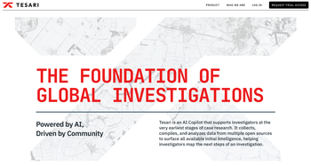

- [OSINTech OSINT Timeline](https://github.com/bormaxi8080/osint-timeline) weekly newsletter with collection of tools, services and investigations.

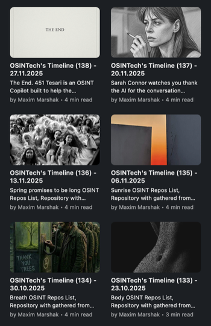

- [OSINT Anatomy Substack](https://osintech.substack.com/) a practitioner-focused OSINT publications. Investigative OSINT and applied research for journalists, analysts, and technical investigators (included Substack OSINT Timeline version).

- [OSINTech Dashboard](https://github.com/bormaxi8080/osint-dashboard) links collection on start.me service (more than 3000 links). Private repository, available on demand.

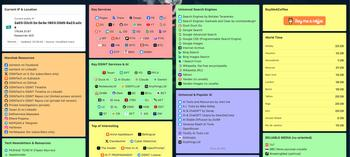

- [OSINT Repos List](https://github.com/bormaxi8080/osint-repos-list) of GitiHub Starred Repositories and its creators (more than 3000 repositories and contributors). Private repository, available on demand.

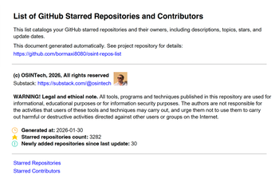

- [Epshtein Archive Parser](https://github.com/bormaxi8080/ea-parser) A small toolkit to download and analyze files from the DOJ Epstein Archives and to inspect PDF collections for duplicates and redactions, and decomposite masked blocks. 6787 unmasked blocks on 89Gb data. Private repository, available on demand.

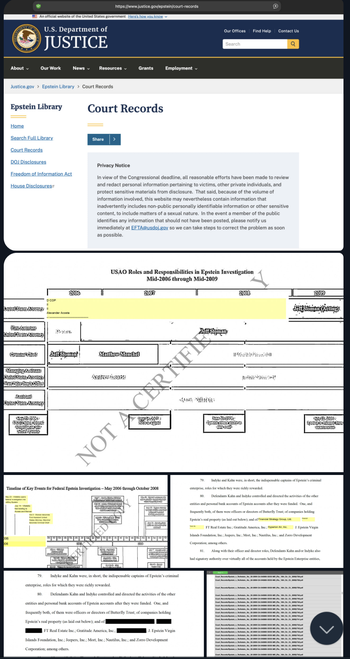

- [IP & Location Widget](https://github.com/bormaxi8080/location-widget) mini widget for the start.me start page: shows public IP, IPv4 (if available), country, and flag. Refreshes every 60 seconds and supports manual refresh.

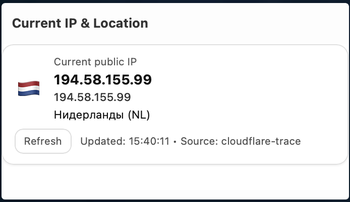

---

## My GitHub statistics

---

## My Soft Skills and Communications

- Experience in searching for people, facts from various sources, in social networks monitoring and promoting communities, including closed ones
- Interest in the application of OSINT techniques, research and investigations. Experience in automating, developing and configuring solutions for OSINT investigations, managing various datasets with data about people, companies, incidents and some artifacts to research it
- Strong skills in backend development (Python/Ruby/JS/Perl/Bash)
- Strong skills in communication and hiring specialists in various career areas, mainly IT. Extensive experience in career OSINT, hiring and relocating specialists, all kinds of communications

## My Technical Stack

- Python, Node.js, JavaScript, Ruby, Perl, Bash
- PostgreSQL, MongoDB, MySql, Redis, Django, Celery, RabbitMQ
- AWS (EC2, Amplify, S3, RDS, Route 53, DynamoDB), ClickHouse, Prometheus, Grafana, Zabbix
- Linux (Ubuntu, Debian, Kali, Amazon Linux, Arch Linux, Parrot OS, Mikrotik OS, CentOS, FreeBSD), MacOS, Windows, Virtualization (VirtualBox, Vagrant, VMWare), Docker - at the level of normal, advanced in places, DevOps. I have a talent to install and configure any software so that it works on any systems and configurations
- Some frameworks & tools for highload, queuing, mutli threading, multi processing, sharding, etc. for building optimal technical solutions
- OSINT frameworks & tools to realize investigations for various resources
- Selenium, Puppeteer and at different times a bunch of all sorts of exotics for parsing, scraping, crawling and data enrichment
- Various protocols related to e-mail (POP3, IMAP, MTA logs, verification and validation of addresses through various services, mass mailings)

## Non-core Technologies

- C++ as a secret rarely used skill
- Java, .NET - at the level of “I can, but without fanaticism”
- PHP - at the level of “collect or fix something quickly”
- Vue, React - at the level of understanding how it works (there is no industrial experience in frontend development)
- Delphi, Embarcadero, VBScript as oldfag
- UX, Figma, CSS, Styles - I can make it nice if needed

---

## My Profile Notices

Unlike many people who are interested in OSINT and information security, I do not seek to be anonymous, and information about me is open to a reasonable extent. This is a principled position aimed at popularizing research activities and supporting democratic values ​​in the world.

For quite a long time I was engaged in hiring specialists in IT and took about 260 families outside RF. With the beginning of war in Ukraine, I left Russia, and I do not consider offers from Russian corporations, state structures, and office work within Russia. Now I live in other countries.

In parallel with development and investigations, I was involved of various communities, including non-core for IT, and met a lot of interesting and famous people: social activists, journalists, politically concerned citizens, HR, PR people, developers, security specialists, etc. At a certain point, this activity logically led me to become interested in OSINT.

---

## My Contacts / Social Links

Substack: [@osintech](https://osintech.substack.com)

LinkedIn: [@osintech](https://www.linkedin.com/in/osintech/)

---

## My Resume & Portfolio

OSINT, Software Development & Journalistic redactions available on demand.

---

## My OSINT digests

- [OSINT Anatomy Substack](https://osintech.substack.com/) a practitioner-focused OSINT publications. Investigative OSINT and applied research for journalists, analysts, and technical investigators.

- [OSINTech's Timeline on GitHub](https://github.com/bormaxi8080/osint-timeline) weekly updated nesletter with collection of tools, services and investigations.

- [OSINT Dashboard](https://github.com/bormaxi8080/osint-dashboard) for start.me service (available on demand).

- Systematized [OSINT Repos List](https://github.com/bormaxi8080/osint-repos-list) of my GitHub starred repositories, same lists of stars by categories (full version available on demand).

---

## My Projects Timeline

Continued...

**Aug 2025 / Now:** [Tesari.AI](https://tesari.ai/). OSINT Engineer & Library Curator

- Contributed as an OSINT Engineer and library curator at Tesari AI, focusing on data collection and management.

- Leveraged advanced methodologies to support investigative processes and align with organizational objectives.

- Ensured the effective curation of data for actionable insights, enhancing overall operational efficiency.

**Jan 2026:** [Epshtein Archive Parser](https://github.com/bormaxi8080/ea-parser) A small toolkit to download and analyze files from the DOJ Epstein Archives and to inspect PDF collections for duplicates and redactions, and decomposite masked blocks. 6787 unmasked blocks on 89Gb data. Private repository, available on demand.

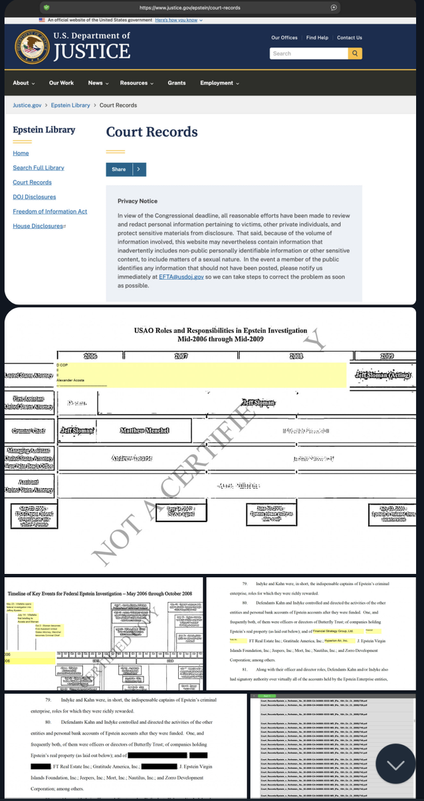

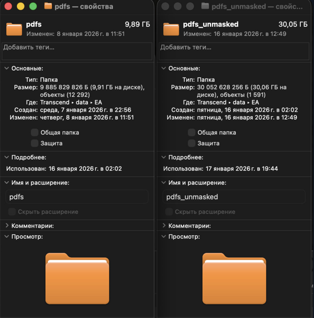

**Jan 2026:** [OSINT Repos List](https://github.com/bormaxi8080/osint-repos-list) of GitiHub Starred Repositories and its creators (more than 3000 repositories and contributors). Private repository, available on demand.

**Dec 2025:** Together with [@paulpogoda](https://github.com/paulpogoda), we authored the course "ABCs of Prompt Engineering" on the specifics of AI and prompt engineering. The course consisted of four lectures and was held on the [kislorod.io](https://kislorod.io) platform.

**Sep 2024 / Jun 2026:** Began studying at the OLSHA Open Literary School (several literary publications have been written).

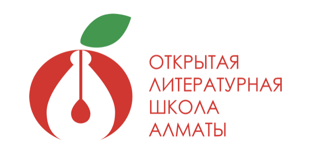

**Sep 2024 / Jun 2026:** Began studying at Journalism speciality (several jounalistic publications have been written).

**Aug 2024, Sep 2025:** Completed [@paulpogoda](https://github.com/paulpogoda) Profiling OSINT Courses

**Apr 2023 / Now:** OSINT Timelines and Collections activities

**Jun 2022 / Now:** OSINT & Investigative Journalistic Activities. Private projects about collecting social data

**Nov 2022 / Sep 2025:** Private projects about AD processing (big conveyor)

**Nov 2022 / Aug 2024:** Private projects about email checking (big conveyors)

**Jan 2023 / Apr 2023:** Private project about collecting companies data on LinkedIn

**Sep 2022 / Aug 2023:** Help for those who fled from mobilization in Russia (non-disclosured)

**Sep 2022:** Create [linkedin2md repository](https://github.com/bormaxi8080/linkedin2md) illustrates a scheme for building a simple resume/profile database based on a minimalist approach and storing structured profile information in markdown format. Transferring my data (about 50,000 people profiles) from proprietary formats to markdown

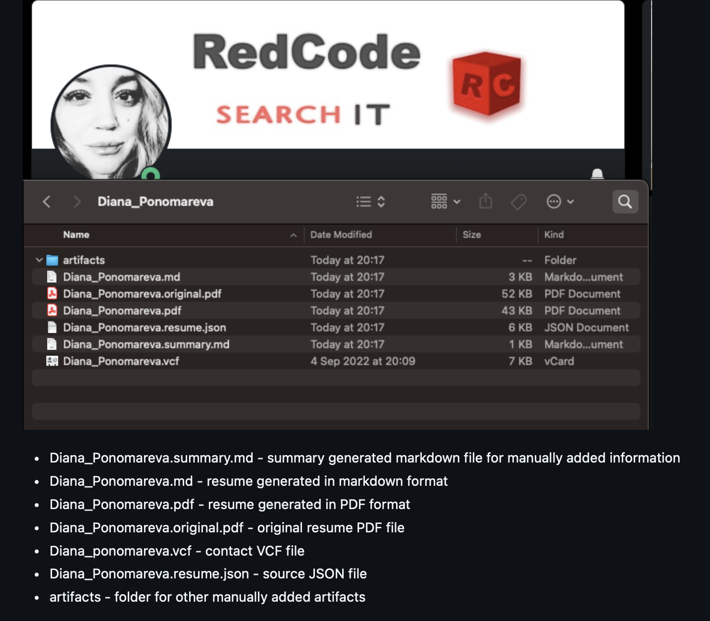

**2022:** [Huginn](https://github.com/bormaxi8080/huginn) private fork/community commits

**2022:** [OSINT Framework fork](https://github.com/bormaxi8080/OSINT-Framework)

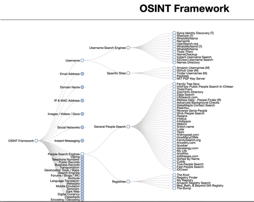

**2022:** [Telepathy](https://github.com/bormaxi8080/Telepathy) project updates & [components](https://telepathy.freedesktop.org/components/)

**2022:** Start a [facebook-ban-phrases](https://github.com/bormaxi8080/facebook-ban-phrases) project, the list of phrases in different languages for which you can get banned on Facebook

**May / Jun 2022:** Leave Russian Federation

**Mar / May 2022:** Prepare and change my server infrastructure and communities to the military situation in the world

**Mar 2022 / Aug 2024:** War Crimes Documentation project help (non-disclosured)

**Feb 2022:** Create [batu-poll-checker](https://github.com/bormaxi8080/batu-poll-checker) utility for monitoring the results of voting for orangutan Batu in the election of a New Year's mascot in Novosibirsk, Russia, february 2022, with all the world and Russian media wrote about this incident.

**Jan 2022:** Worked on the creation of a complex highload email verification system (private)

**Jan 2022:** Create a [NMap packet domain list scanner](https://github.com/bormaxi8080/nmap-scanner) utility, some OSINT tools experiments

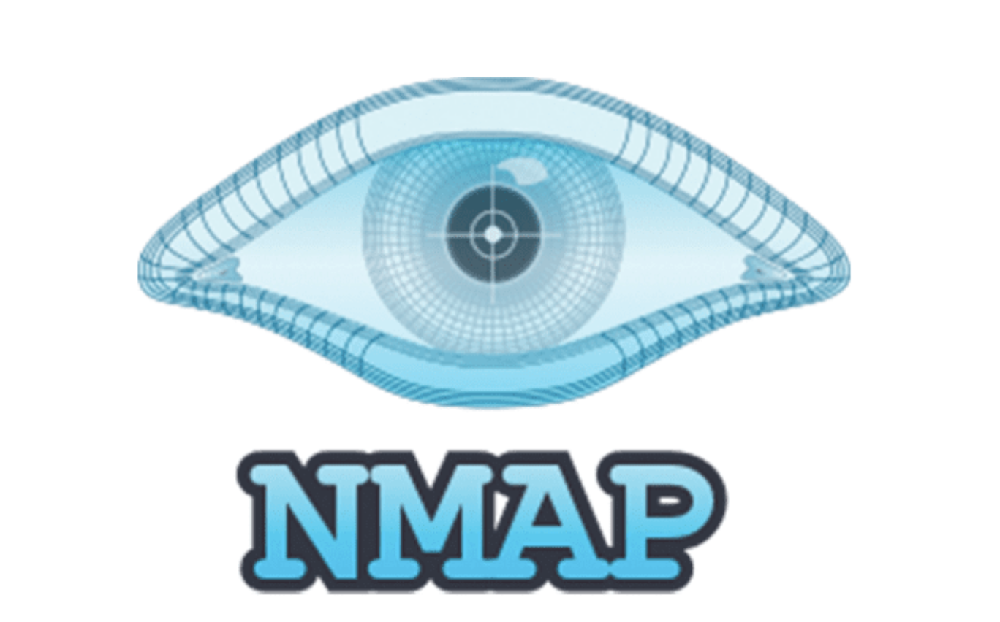

**Dec 2021:** Close my hiring agency and checkout into NDA place as software developer

**Jun 2021 / Dec 2024:** A **RIP Leaks** community project,  publicly oppose the processes of Russian import substitution, including in the IT sector, and cover news on this topic. Project closed.

**Jun 2020:** Start a Ebenya Rodiny (aka Fucking Motherland) project, one of the largest collections of graffiti and street art in the world.

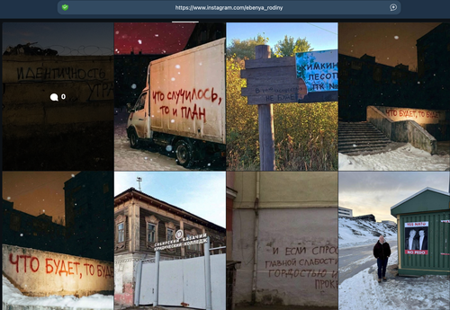

**Mar 2020 / Sep 2020:** Compelled Career Break by private reasons

**Jun 2019:** Start hiring developers in Improve Group, the best all-time IT company in Novosibirsk, mobile application development. Hiring employees, hiring employees, hiring employees. First I worked under a contract, then in the state. The company closed in 2021.

**2018 / 2019:** Moderate one of largest HR communities in Russian facebook segment.

**2015:** Start a Hiring Agency

A small warm tube recruitment agency. Recruitment geography: Novosibirsk, remote location, relocation from the RF to Europe (I took more than 260 families outside the Russian Federation).
Hiring candidates in IT from the middle level.
Automated candidate database of 30+ thousand people.
I created my own community, for 6 years I gained a lot of connections and insights among different companies at different times in the team from 1 to 6 recruiters.
Worked with companies such as Exness, Intel, Plesk, DevExperts, Think-Cell and many others.

A lot of different communications and activities.

**2013:** A [Pencil Test](https://habr.com/ru/articles/193902/) habr's publication with 1M+ views

**2000 / 2015:** Software Development in various projects.

---

**Especially for my friends and opponents:**

I publicly oppose war and Russian political system. I help projects aimed at exposing state and war crimes (non-disclosured).

I provide consulting and hands-on support in open-source intelligence (OSINT), investigative research, and data-driven analysis.
Expertise includes OSINT investigations, custom tooling and workflows, data collection and scraping, people and corporate intelligence (KYC, background research), and support for investigative journalism and research communities.
I do not collaborate with the Russian public sector, Russian banks, or import substitution–related companies.

---

## Donates

If you like the projects that I do, I will be grateful for donations in private dialogue.

---
