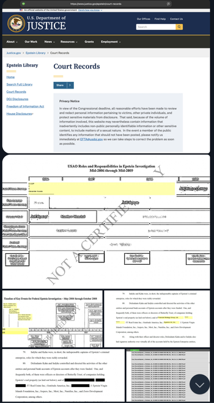
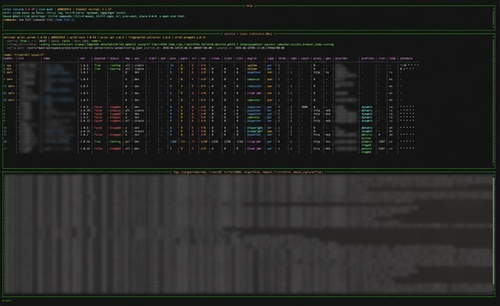
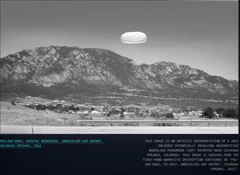
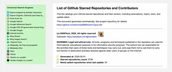
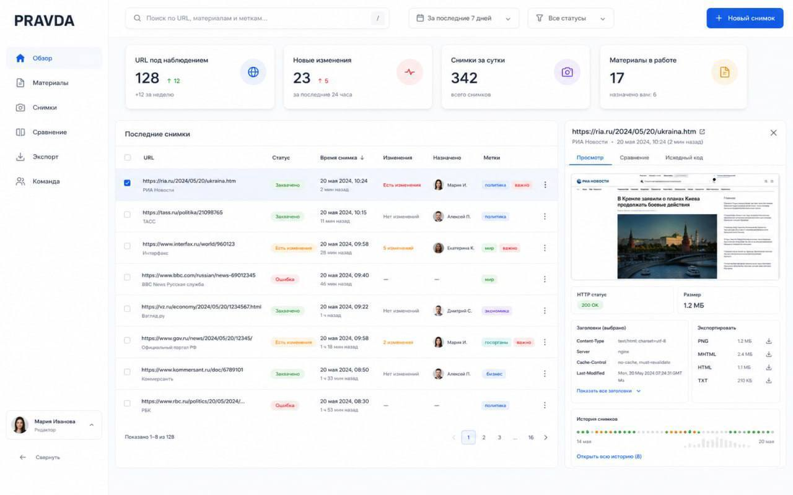
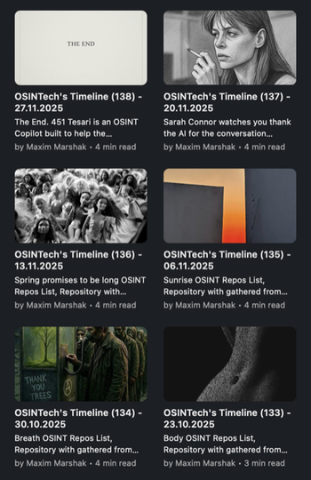
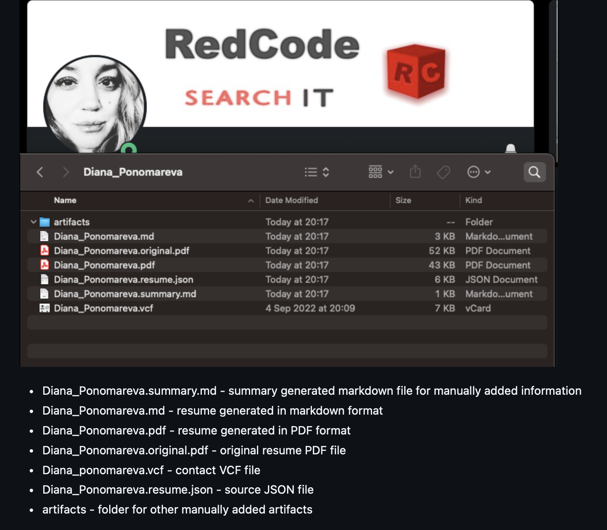

# Maxim Marshak / OSINTech

**Research Data Analyst | OSINT Engineer | Investigative Data**  
**Python · SQL · PostgreSQL · Data Collection · Parsing · Data Quality · AI-assisted Research**

I work with complex, heterogeneous, and unstructured information - from raw-source acquisition and automated collection to parsing, normalization, validation, structured datasets, and investigative analysis.

My background combines **20+ years in software engineering and data-intensive systems** with **5+ years focused on OSINT, investigations, research, and technical knowledge curation**. I build tools and workflows that turn fragmented public information into reusable, queryable, and verifiable research data.

[LinkedIn](https://www.linkedin.com/in/osintech/) · [Substack / OSINTech](https://osintech.substack.com/) · [OSINTech Timeline](https://github.com/bormaxi8080/osint-timeline) · Email: `m.marshak@proton.me`

---

## From Raw Sources to Research Data

```text
Raw sources
    ↓
Collection / Crawling
    ↓
Parsing & Structured Extraction
    ↓
Normalization & Enrichment
    ↓
Validation / Deduplication / Provenance
    ↓
Structured Research Datasets
    ↓
Analysis & Investigative Research
```

I work across this entire pipeline, combining research methodology with hands-on engineering.

---

## Selected Research & Data Projects

### 1. Epstein Archive Parser - Large-Scale Investigative Data Processing

[Repository](https://github.com/bormaxi8080/ea-parser)

A research and data-processing toolkit for downloading, parsing, and analyzing documents from the U.S. DOJ Epstein Archives.

**Scale:** approximately **89 GB of source data**; automated analysis identified **6,787 unmasked blocks**.

Key areas:
- large-scale archive and PDF processing;
- automated downloading and parsing;
- duplicate detection;
- redaction and masked-block analysis;
- structured extraction from raw source material;
- investigation-oriented processing and validation.

The project demonstrates a workflow from raw public archive acquisition to automated processing and structured investigative analysis.



---

### 2. Oriol Web Crawler - Scalable Research Data Collection

A scalable Python-based system for automated collection of heterogeneous web data, browser automation, and reproducible research workflows.

Key areas:
- automated crawling and data acquisition;
- multi-engine collection using Playwright, Puppeteer, Camoufox, HTTP requests, AdsPower, and other tools;
- scenario-based collection workflows;
- parallel and distributed processing;
- reusable processing logic for multiple source types;
- AI-assisted scenario generation and adaptation.

Oriol is designed to separate collection logic from individual sources and make complex acquisition workflows configurable, reproducible, and scalable.



---

### 3. U.S. Department of War UFO Archive - Structured Research Dataset

[Source archive](https://www.war.gov/UFO/)

Created a structured snapshot of the U.S. Department of War UFO archive using Oriol Web Crawler.

The workflow converts a heterogeneous public web archive into a reusable **JSON research dataset** suitable for querying, archival analysis, automated processing, and further enrichment.

**Pipeline:** public archive → automated crawling → extraction → normalization → structured JSON dataset.



---

### 4. OSINT Repositories Intelligence Pack - Curated Technology Dataset

[Repository](https://github.com/bormaxi8080/osint-repos-list)

A curated research dataset covering **3,000+ OSINT-related GitHub repositories and creators/contributors**.

Key areas:
- large-scale resource discovery and curation;
- repository and contributor data collection;
- entity-centric organization;
- classification and categorization;
- metadata enrichment;
- continuous maintenance of a changing technical ecosystem.

The project is designed as a reusable research resource for discovering and analyzing OSINT tools, developers, and technologies.



---

### 5. Source Credibility & Evidence Tooling

#### Source Credibility Overlay

[Repository](https://github.com/bormaxi8080/sco-chrome-extension)

Chrome extension and backend API for transparent source-credibility signals. The system collects technical and contextual indicators, explains them, and recommends manual verification when risk is elevated rather than making unsupported binary claims about source reliability.

Focus: **source quality, explainability, provenance, verification workflows, and reproducible evidence assessment**.


#### Pravda Prototype

Backend utility for capturing web pages as evidence using real Chrome via Playwright. It stores page snapshots together with metadata so researchers can later demonstrate what a source looked like at a specific time.

Focus: **evidence preservation, metadata, provenance, reproducibility, and research archiving**.



---

### 6. OSINTech Timeline - Continuous OSINT Research & Curation

[GitHub](https://github.com/bormaxi8080/osint-timeline) · [Substack](https://osintech.substack.com/)

A long-running research and curation project tracking OSINT tools, investigations, datasets, AI technologies, cybersecurity resources, and research methods.

Each edition combines continuous source monitoring, manual review, classification, curation, and publication for investigators, journalists, analysts, and technical researchers.

The project has been maintained since 2023 and functions both as a practitioner-oriented publication and as a continuously evolving research collection.



---

### 7. linkedin2md - Structured People Data Migration

[Repository](https://github.com/bormaxi8080/linkedin2md)

A data-migration and information-structuring project developed while reorganizing a large professional-profile database.

It illustrates a minimalist approach to storing structured information about people in human-readable Markdown instead of proprietary formats and was used during migration of a dataset that grew to approximately **50,000 professional profiles**.

Focus:
- entity-centric people data;
- data migration;
- structured profile representation;
- searchable and portable records;
- long-term maintainability of research data.



> For my full projects list see [OSINTech Projects Change Log](CHANGELOG.md)

---

## Current / Recent Research Work

### Evidentia / Sourcely

Software for journalists, fact-checkers, and OSINT researchers to verify sources, structure evidence, and turn open data into trustworthy investigations.

My work is focused on research, OSINT, data processing, automation, and AI-assisted workflows at the intersection of investigative research and software engineering.

### Tesari.AI - OSINT Engineer & Research Data Curator

[Tesari.AI](https://tesari.ai)

Worked with heterogeneous investigative data, collection and curation, research-data quality, source coverage, report QA, and AI-assisted investigation workflows.

Key areas included:
- OSINT and investigative data collection;
- data curation and organization;
- completeness, accuracy, freshness, and consistency assessment;
- source verification and enrichment;
- review and QA of generated investigative/company reports;
- collaboration on research logic and data-related tooling.


---

## Core Expertise

### Research & Data

- Research data analysis
- OSINT and investigative research
- Structured and unstructured data processing
- Data collection and enrichment
- Data quality and validation
- Source verification and provenance
- Entity-centric research on people, companies, incidents, relationships, and artifacts
- Research dataset design and curation

### Data Engineering & Automation

- Python and SQL
- PostgreSQL and ClickHouse
- APIs and backend services
- Parsing, scraping, crawling, and structured extraction
- Automated imports/exports and processing workflows
- Data normalization, deduplication, and consistency checks
- Docker/Linux-based research infrastructure

### AI-assisted Research

I use modern LLMs and agentic tools for:
- structured extraction;
- classification;
- research assistance;
- coding and prototyping;
- source analysis;
- data transformation;
- workflow automation.

**AI output is treated as an intermediate result, not as a source of truth:** model-assisted workflows are combined with deterministic checks, source-based verification, and human review where required.

### Research Communication

- Investigative journalism
- Technical writing
- Knowledge curation
- Research methodology
- Technical publications for OSINT and investigative communities

---

## Technical Stack

**Data & Analytics**  
Python · SQL · PostgreSQL · ClickHouse · JSON · CSV · APIs

**Collection & Processing**  
Playwright · Puppeteer · Selenium · Camoufox · Crawling · Parsing · Scraping · Data Enrichment

**AI & Research Tooling**  
OpenAI / Codex · Claude · Perplexity · NotebookLM · LLM workflows · Structured Extraction · Agentic Tools

**Backend & Automation**  
Node.js · JavaScript · Ruby · Perl · Bash · Django · REST APIs · Celery · RabbitMQ

**Infrastructure**  
Docker · Linux · macOS · AWS · Git · Prometheus · Grafana · Zabbix

**Additional engineering experience**  
C/C++ · Java/.NET · PHP · frontend technologies · virtualization · legacy development stacks

---

## Publications & Knowledge Curation

### OSINTech / Substack

[https://osintech.substack.com](https://osintech.substack.com/)

Practitioner-focused technical publication covering:
- OSINT and investigative methodologies;
- data and research tooling;
- AI-assisted investigations;
- cybersecurity and verification;
- automation and technical research infrastructure.

### OSINTech Timeline

[GitHub](https://github.com/bormaxi8080/osint-timeline)

A regularly updated collection of tools, services, datasets, investigations, and research methods for the OSINT community.

### LinkedIn

[https://www.linkedin.com/in/osintech/](https://www.linkedin.com/in/osintech/)

Technical articles, OSINT research, tooling notes, data-oriented case studies, and professional updates.

---

## Selected Additional Projects & Experiments

These projects are not part of the core Research Data Analyst portfolio but reflect broader engineering and OSINT experience:

- [OSINTech Scam Surface Mapper](https://github.com/bormaxi8080/Scam-Surface-Mapper) - graph-based mapping of suspicious web infrastructure for OSINT and fact-checking.
- **CRPA / Content Credentials Metadata Extractor** - extraction and analysis of content-origin metadata and AI-generation indicators.
- **Oriol Fingerprint Collector** - diagnostic server for browser/device fingerprint collection tests.
- [just-ai](https://github.com/bormaxi8080/just-ai) - AI extension for the `just` command runner with project-context analysis and local risk scoring.
- [fcc-model-check](https://github.com/bormaxi8080/fcc-model-check) - health-check utility for model routing between Free Claude Code and NVIDIA NIM.
- [IP & Location Widget](https://github.com/bormaxi8080/location-widget) - lightweight public-IP and location widget.
- [Martin](https://github.com/bormaxi8080/martin-codex-pet) - experimental animated companion for Codex Desktop.

---

## Professional Background

My professional background combines:

- **20+ years of software engineering**, backend development, databases, integrations, automation, and infrastructure;
- **5+ years focused on OSINT, investigations, and research**;
- experience building and maintaining an automated people-data system that grew to approximately **50,000 professional profiles**;
- investigative and journalistic research;
- technical knowledge curation and publishing;
- collaboration with researchers, journalists, engineers, and technical communities.

I studied programming/mathematics, history, psychology, literature, and journalism. This combination of engineering and humanities research strongly influences how I approach investigative data: technically rigorous, source-aware, and context-sensitive.

---

## GitHub Statistics


---

## Professional Principles

I work openly under my real identity and support independent research, investigative journalism, human-rights work, and democratic civic initiatives.

I publicly oppose Russia's war against Ukraine and support projects documenting state and war crimes.

I do not collaborate with Russian public-sector institutions, Russian banks, or import-substitution-related companies.

---

## Contacts

- **LinkedIn:** [linkedin.com/in/osintech](https://www.linkedin.com/in/osintech/)
- **Substack:** [osintech.substack.com](https://osintech.substack.com/)
- **GitHub:** [github.com/bormaxi8080](https://github.com/bormaxi8080)
- **Email:** `m.marshak@proton.me`

---

## Support

[](https://buymeacoffee.com/osintech)

If you find my research, tools, or publications useful, you can support OSINTech through Buy Me a Coffee.

---

> **Note:** The full chronological project history is intentionally omitted from this landing page to keep the profile focused. It maintained separately as [CHANGELOG.md](CHANGELOG.md) portfolio page.
